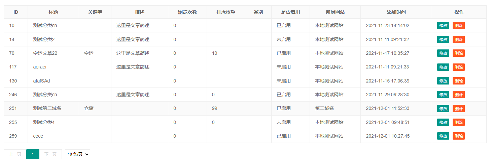

# yii-table-widget

#### 介绍
封装带分页的table widget


#### 安装教程

composer require yuankezhan/yii-table-widget

#### 使用说明


```
    <?= TableWidget::widget([
        'data' => $data,
        'columns' => [
            Column::set('ID', 'id'),
            Column::set('标题', 'title'),
            Column::set('关键字', 'keywords'),
            Column::set('描述', 'describe'),
            Column::set('浏览次数', 'views'),
            Column::set('排序权重', 'sort'),
            Column::set('类别', '', Column::TYPE_FUNC, function ($item) {
                return $item['articleCategory']['name'] ?? '';
            }),
            Column::set('是否启用', '', Column::TYPE_FUNC, function ($item) {
                if ($item['show']) {
                    return '已启用';
                }
                return '未启用';
            }),
            Column::set('所属网站', '', Column::TYPE_FUNC, function ($item) {
                return $item['web']['des'];
            }),
            Column::set('添加时间', 'add_time'),
            Column::set('操作', '', Column::TYPE_FUNC, function ($item) {
                return [
                    TableButton::set('修改', Url::to(['article/edit-article-first', 'key' => $item['article_key']])),
                    TableButton::set('删除', "deleteList(this, {$item['article_key']})", TableButton::TYPE_BUTTON, TableButton::THEME_DANGER)
                ];
            }),
        ],
        'page' => [
            'pageIndex' => $pageIndex,
            'pageSize' => $pageSize,
            'count' => $count,
            'url' => Url::current()
        ]
    ]) ?>
```


```

foreach ($info->data['list'] as $dItem)
 {
    $rowData = [
        TableTd::set($dItem['user_id'], ['class' => 'id', 'style' => 'width:80px']),
        $dItem['username'],
        TableTd::set($dItem['mobile_phone'], ['style' => 'width:150px']),
        TableTd::set($dItem['email'], ['style' => 'width:100px']),
        $dItem['reg_time'],
        $dItem['nick_name'],
    ];
    $rows[] = Row::set($rowData, [
        TableButton::set('编辑员工信息', Url::to(['employee/edit', 'userId' => $dItem['user_id'], 'from' => Yii::$app->request->getUrl()]), TableButton::TYPE_LINK),
        TableButton::set('修改', Url::to(['user/update', 'id' => $dItem['user_id']]), TableButton::TYPE_LINK),
        TableButton::set('删除', "deleteUser(this, '{$dItem['user_id']}')", TableButton::TYPE_BUTTON, TableButton::THEME_DANGER)
    ]);
}；

$page = [
    'pageIndex' => $pageIndex,
    'pageSize' => $pageSize,
    'count' => $info->data['count'],
    'url' => Url::current($searchModel->toArray())
];

<?= TableWidget::widget([
    'head' => ['ID', '用户名', '电话', '邮箱', '注册时间', '昵称', '操作'],
    'rows' =>  $rows,
    'page' => $page
])?>
```

